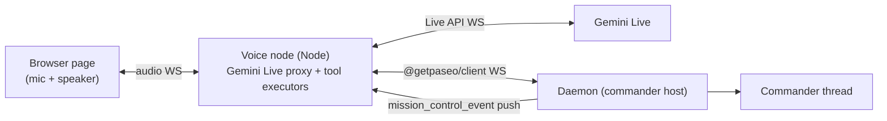
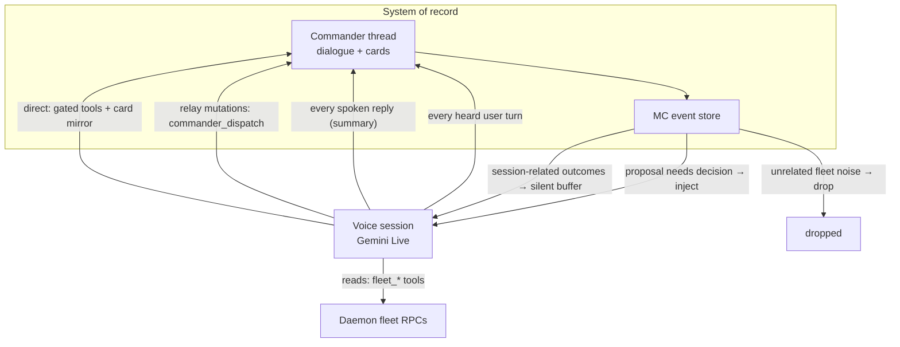

# Commander Voice

A voice front-end for the Commander: you talk, it dispatches, the fleet works. Built on the Gemini Live API (bidirectional audio streaming with server-side tool calling), starting from the `gemini-live-speech` prototype on iammvaibhav (`~/experiments/gemini-live-speech`: a Node WS proxy bridging browser audio to Gemini Live, with server-side tool executors). [docs/commander.md](commander.md) owns what the Commander is; this doc owns the voice layer in front of it.

## Design position

Voice is a **spoken client of the same fleet contract as Commander**, not a second product surface. It never invents tools, never bypasses the approval gate, and never owns a parallel durable dialogue. The Commander thread is the system of record; voice is how you talk to the fleet.

Two modes (Mission Control setting, default **relay**):

- **relay** — voice answers questions with the same **read** tools Commander has; every **mutating** intent goes to Commander via `commander_dispatch`.
- **direct** — voice may call the full Commander tool surface itself (still approval-gated for mutations); every call is mirrored into the Commander thread.

Both modes are **tool-first**: no world snapshot, no compact host pack, no roster injection. The Live session context is system prompt + conversation turns + tool results. That is deliberate. Commander injects a snapshot so a text model can place work without a tool round-trip; Live tool calls are fast enough that voice should **look things up** instead of carrying a stale worldview.

Non-blocking for mutations in relay: `commander_dispatch` returns immediately ("on it"); results arrive later only when they matter under the announce policy. Direct mode may await its own tool results inside the Live turn.

## Architecture



The voice node runs on the commander host next to the daemon. It holds the Gemini API key and the daemon password; the browser page holds nothing.

## Tool surfaces

### Shared read tools (both modes — same as Commander)

Imported from the Commander contract / tool catalog. Do not hand-maintain a voice-only list.

| Tool                       | Purpose                                                                                                                                                                                                   |
| -------------------------- | --------------------------------------------------------------------------------------------------------------------------------------------------------------------------------------------------------- |
| `fleet_list_agents`        | Roster across hosts (status, titles, hosts).                                                                                                                                                              |
| `fleet_get_agent_activity` | Curated **timeline summary** for one agent on a host — recent projected messages from stored activity. **Read-only.** Does **not** poke the live agent or ask it for a fresh report; it is not a “nudge”. |
| `fleet_search`             | Find agents by what they worked on.                                                                                                                                                                       |
| `fleet_recall`             | Semantic recall over fleet memory.                                                                                                                                                                        |
| `fleet_context`            | Run records / workspace·project rollups.                                                                                                                                                                  |
| `tag_message`              | Attribute the current user turn to agents (audits).                                                                                                                                                       |

There is **no** `fleet_status`. Aggregate status is `fleet_list_agents` (count/filter in the model). Host-local status tools are banned.

**Read vs nudge (fresh status):**

| Want                                                   | Mechanism                                                                               | Voice relay                                                                                                            | Voice direct                                                   |
| ------------------------------------------------------ | --------------------------------------------------------------------------------------- | ---------------------------------------------------------------------------------------------------------------------- | -------------------------------------------------------------- |
| Latest **already recorded** status / timeline          | `fleet_list_agents` + `fleet_get_agent_activity`                                        | Yes (read tools)                                                                                                       | Yes                                                            |
| **Nudge** the live agent to post a fresh update        | `fleet_send_prompt` (gated steer/interrupt) asking for a short status / `report_status` | **Not declared.** Use `commander_dispatch` (“nudge Archimedes for a fresh status”) so Commander owns the send proposal | Yes — call `fleet_send_prompt` (approval-gated like Commander) |
| Automatic silence/status-ask while an agent is stalled | Mission Control stall machinery (`forceSend` status-ask nudge)                          | Daemon, not a voice tool                                                                                               | Daemon, not a voice tool                                       |

There is no separate `nudge` tool. Commander’s “nudge for latest” is `fleet_send_prompt`. Voice must use the same path (via Commander in relay, directly in direct). After a nudge, the fresh content appears when the agent reports or when the user re-asks and activity is re-read — voice stays quiet until then unless the user asked to wait on that agent.

**Generic vs specific updates:**

- “Any updates?” / “what happened while I was away?” → `pending_updates()` only (session buffer).
- “What is Archimedes doing?” (passive) → read tools only.
- “Nudge Archimedes / get me a fresh status from Pia” → relay: `commander_dispatch`; direct: `fleet_send_prompt` after resolving host/agentId.
- Never answer a named-agent question from the silent buffer alone.

### Relay tool set (only these are declared)

The Live session **does not declare** mutating tools. The model cannot call what it cannot see.

| Tool                                                   | Purpose                                                                                      |
| ------------------------------------------------------ | -------------------------------------------------------------------------------------------- |
| Shared read tools (table above)                        | Answer fleet questions without Commander.                                                    |
| `commander_dispatch(message)`                          | Any work that changes the fleet or needs placement — plain-language intent to the Commander. |
| `proposal_respond(proposalId, action, editedMessage?)` | Approve / deny / edit a pending proposal.                                                    |
| `pending_updates()`                                    | Drain the silent session buffer — only when the user asks for generic updates.               |

Relay prompt says: use reads for questions; use `commander_dispatch` for anything else. No “never call X” list — those tools are absent.

### Direct tool set

Full Commander allowlist **plus** `proposal_respond` and `pending_updates`. Mutating tools stay approval-gated. `commander_dispatch` is unused (voice is the brain).

### Why this parity

- Same read tools → same answers whether you type to Commander or speak to voice.
- Relay mutations only via Commander → one placement doctrine, one approval surface.
- Direct reuses the same contract package → when tools change, both modes change.

## Context model (what is in the Live session)

### In context

| Piece                                                                     | When                                                                                          |
| ------------------------------------------------------------------------- | --------------------------------------------------------------------------------------------- |
| **System prompt** (mode-specific; see below)                              | Session setup; stable for the session                                                         |
| **User conversation** (heard + spoken turns)                              | Continuous; Gemini Live history + our resume reinjection of last few turns if the handle dies |
| **Tool results** for calls this session made                              | Live API tool-response channel                                                                |
| **Injected announcements** only for proposals that need a verbal decision | Rare; see announce policy                                                                     |

### Never in context

- World snapshot / fleet map / project·workspace inventory
- Full roster or “running counts per host” pack
- Model catalogs
- Mission Control card stream
- Random finished/started/milestone events

If the model needs a host, project, workspace, agent, or status, it **calls a tool**. Guessing from memory of an old turn is wrong; the prompt forbids it.

### Resume after Gemini disconnect

Prefer Gemini `sessionResumption` (full Live history restored). If that fails, reinject **only**:

1. last N conversation turns (heard/spoken), and
2. any still-pending proposal one-liners the user has not answered.

No worldview pack on resume either.

## Announce policy (quiet by default)

Voice is **not** Mission Control chat. The feed shows every card; voice does not.

The voice agent speaks only when:

1. **You asked something** — it answers (after tools if needed).
2. **A proposal needs your verbal decision** — one-line summary, then wait for approve/deny/edit. Destructive proposals require an explicit “yes, approve”. Proposals still interrupt (spoken inject).
3. **You asked for generic updates** — `pending_updates()` drains the session buffer as a short spoken digest.

It does **not** speak for:

- agent started / finished / milestone / verdict / self-report (unless that is the answer to a specific question they just asked)
- Commander cards they did not ask about
- background fleet noise

### Generic vs specific update routing

| User said                                                    | Tool path                                                                          |
| ------------------------------------------------------------ | ---------------------------------------------------------------------------------- |
| “Any updates?” / “What’s new?”                               | `pending_updates` only                                                             |
| “How is Archimedes?” / “What are the stackmod agents doing?” | `fleet_list_agents` / `fleet_search` → `fleet_get_agent_activity` (not the buffer) |
| “Did my spawn finish?” (session work, no name)               | Prefer `pending_updates`; if empty, specific tools                                 |

### What enters the silent buffer

Only events **tied to this voice session’s work**:

- outcomes of agents this session spawned or steered (relay: Commander proposals/dispatches from this session; direct: agents voice created/sent)
- answers to questions this session asked (correlated)
- proposals that still need a decision (also eligible for inject when they need speech)

Everything else is **dropped**, not buffered. “Any updates?” is never fleet-wide gossip.

`pending_updates` is pull-only. The proxy never injects buffer contents unprompted.

## Modes: relay vs direct (setting)

Mission Control central config (and voice-node env for the standalone page): `voiceMode: "relay" | "direct"`, default `relay`. Changing the setting applies to new voice sessions; an open session keeps the mode it started with until End.

|                            | **relay**                                                                  | **direct**                                                          |
| -------------------------- | -------------------------------------------------------------------------- | ------------------------------------------------------------------- |
| Declared tools             | Reads + `commander_dispatch` + `proposal_respond` + `pending_updates` only | Full Commander allowlist + `proposal_respond` + `pending_updates`   |
| Mutations                  | `commander_dispatch` → Commander                                           | Voice calls gated tools itself                                      |
| Answers to fleet questions | Voice read tools + spoken reply                                            | Voice tools + `post_answer` mirrored                                |
| Placement doctrine         | Commander prompt                                                           | Voice direct prompt (spoken subset)                                 |
| Latency shape              | Reads: live tools. Mutations: “on it” then later buffer                    | Reads + mutations in the Live turn (mutations may wait on approval) |
| Failure domain             | Commander can be busy; voice still answers reads                           | Voice owns the whole turn                                           |

### Shared contract (stay in sync)

| Shared piece                        | Owner                             | Consumers                                                            |
| ----------------------------------- | --------------------------------- | -------------------------------------------------------------------- |
| Tool names, schemas, allowlist hash | Commander contract / tool catalog | Commander; voice relay (read slice only); voice direct (full)        |
| Placement doctrine                  | `commander-prompt.md`             | Commander full; voice direct spoken subset                           |
| Approval gate                       | Daemon proposal RPCs              | Both modes for every mutation                                        |
| Event store + feed cards            | Mission Control events            | UI always; voice only under announce policy                          |
| Instruction ledger                  | Daemon                            | Commander always; voice direct when it emits cards with `respondsTo` |

When the allowlist or doctrine changes, regenerate voice tool declarations from the same package. Hand-copied lists are a bug.

### Source of truth and mirror (Commander gets the voice conversation)



1. **Commander thread is durable truth** for dialogue and cards.
2. **Voice is ephemeral** except session JSONL forensics.
3. **Full voice dialogue is mirrored into the Commander thread** so text Commander always has what you said and what voice answered — not only tool calls:
   - each **heard** user utterance → a user message on the Commander thread with `voiceMirrorKind`
   - each **spoken** assistant reply → an assistant message with the same kind (spoken summary, not audio)
   - **direct** tool side-effects already produce proposal/answer/clarify cards; those are the structured half of the same log
4. **Relay** mutations still go through `commander_dispatch` (instruction ledger + Commander cards). Pure Q&A still mirrors so the model thread is complete when you switch back to typing.
5. **UI hide for pure Q&A:** rows with `voiceMirrorKind: "qa"` are hidden unless Mission Control verbose is on. Rows with `voiceMirrorKind: "dispatch"` stay visible. The model thread always keeps both.

Without (3), typing after a long voice session would leave Commander blind to what you already decided by mouth. That is unacceptable.

## System prompts

Two prompts, both short, spoken-first. They are **not** a paste of `commander-prompt.md`. Commander is card-grammar + snapshot-trust; voice is tool-first + quiet.

### Shared voice rules (both modes)

```
You are Mission Control Voice — spoken interface to the Paseo fleet.

Context you have: this system prompt, the live conversation, and results of tools you call.
You do NOT have a fleet map, roster, or project list in context. Never invent hosts, projects,
workspaces, agent names, or status. If you need a fact, call a tool.

Speak short, plain sentences. No markdown, no bullet lists, no raw ids, no tool narration
("I'm calling fleet_list_agents"). Just the answer.

Quiet policy:
- Answer when the user asks.
- When a proposal needs a decision, read one line and wait.
- When the user asks for generic updates ("any updates?"), call pending_updates and summarize briefly.
- When the user asks about a specific agent, workspace, or piece of work **without** asking to poke it, call the read tools
  (fleet_list_agents / fleet_search / fleet_get_agent_activity / …). Do not use pending_updates for that.
- When the user wants a **fresh** status from a live agent (nudge / "ask them"), that is a send:
  relay → commander_dispatch; direct → fleet_send_prompt. fleet_get_agent_activity is not a nudge.
- Never volunteer that something finished, started, or reported unless they asked for updates
  or it is the direct answer to their last question.

Lookups (always tools, never memory):
- Who is running / status → fleet_list_agents
- What is agent X doing (recorded) → fleet_list_agents then fleet_get_agent_activity
  (timeline summary already stored — not a live ping)
- Fresh status from agent X → send path above, not activity alone
- Where is work / who worked on X → fleet_search or fleet_recall
- Workspace or project context → fleet_context after you have ids from list/search

Destructive approvals: say the action is destructive and require an explicit "yes, approve".
A bare "ok" is not consent for destructive proposals.
```

### Relay additions

```
Mode: relay.

Your tools are the read tools plus commander_dispatch, proposal_respond, and pending_updates.
Use read tools for any fleet question.
For any work that changes the fleet — spawn, steer, rename, archive, move, schedule —
call commander_dispatch with the user's intent in plain language. Acknowledge with a short
"on it" and stop. Do not wait for the Commander turn. Results arrive later; only surface them
when the user asks for generic updates or when a proposal needs their decision.
```

(No deny-list: mutating tools are simply not in the tool surface.)

### Direct additions

```
Mode: direct.

You hold the same fleet tools as the Commander. Placement doctrine (spoken form):
1. Explicit user host/workspace/agent wins.
2. Mutating work → matched project, new worktree workspace; never two mutators on one tree.
3. Read-only work → project root or the workspace the change concerns.
4. Follow-up on existing work → same workspace as the change.
5. No project → experiments on that host, or propose a new project if substantial.
6. One agent per unit of work.

Mutating tools are approval-gated. Call them; do not pretend they already ran.
When you need a decision only the user can make, call clarify.
When you answer a fleet question for the record, call post_answer then speak the same content briefly.

Every card that answers a user instruction carries respondsTo when the envelope gives you an id.
```

### How this differs from Commander

|                            | **Commander (text)**                                                     | **Voice (Live)**                                                  |
| -------------------------- | ------------------------------------------------------------------------ | ----------------------------------------------------------------- |
| System prompt              | Full `commander-prompt.md` — cards, ledger, placement, proof conventions | Short spoken rules + mode slice                                   |
| World state                | Full snapshot every turn (and after compaction)                          | **None** — tools only                                             |
| Output grammar             | Only proposal / clarify / post_answer cards in normal mode               | Spoken sentences; direct also emits cards via tools               |
| Chattiness                 | Feed shows all cards                                                     | Silent except ask / proposal decision / explicit generic updates  |
| Mutations                  | Gated tools on the Commander agent                                       | Relay: dispatch only. Direct: same gated tools on voice, mirrored |
| Dialogue continuity        | Thread is the chat                                                       | Every voice turn is **mirrored into the Commander thread**        |
| Subagents                  | Structurally impossible (`--no-tools` + allowlist)                       | Same: only declared Live tools                                    |
| Trust model                | Snapshot is fresher than memory                                          | Tool result is fresher than conversation memory                   |
| `fleet_get_agent_activity` | Curated timeline read                                                    | Same — not a live agent ping                                      |

## Experiment plan

1. ~~Backend session JSONL + Gemini resume~~ (landed).
2. ~~Replace voice-only `fleet_status` with shared **read** tool declarations; dual-mode tool surfaces + prompts~~ (landed).
3. ~~Tighten announce filter: session-correlated buffer; `pending_updates` pull-only; specific agent questions use read tools~~ (landed).
4. ~~Mirror every heard user turn and spoken reply into the Commander thread; hide pure Q&A in UI unless verbose~~ (landed).
5. ~~Mission Control setting `voiceMode: relay | direct` (default relay)~~ (landed).
6. Evaluate on real sessions: answer correctness vs Commander text, mutation latency, quietness, mirror fidelity (can you continue by typing after a long voice session?).
7. Optional: deeper direct executors for `fleet_recall` / `fleet_context` / `tag_message` when client APIs exist; peer-host activity proxy without Commander.

Do not delete relay until direct has proven approval safety and the Commander chat still reads as one coherent log.

## Current implementation note

Dual-mode is implemented in-tree:

- Voice node: mode-aware tools/prompts (`scripts/commander-voice/`), `VOICE_MODE` env + central `voiceMode` after connect.
- Daemon: `mission_control.voice.mirror` appends Commander timeline without a model turn; `voiceMode` on central config.
- App: Settings → Mission Control → Voice tool mode; Commander chat hides `voiceMirrorKind: "qa"` unless verbose.

Deploy/restart the voice node and daemon to pick this up on a live host. Production may still run an older voice binary until redeployed.

## Testing

No microphone needed. Two harness layers:

1. **Logic tests (text mode)**: the Live API accepts text turns in the same session protocol. A headless WS client drives the proxy with text intents and asserts tool-call sequences and daemon effects (proposal created on the dev daemon, `proposal_respond` fired, worker record appears). Deterministic, runs against `.dev/paseo-home`.
2. **E2E audio proof**: synthesize spoken commands with fish.audio TTS (`FISH_AUDIO_API_KEY` in `~/.zshrc` on iammvaibhav), stream the PCM into the Live session as mic audio, capture the audio replies, and assert the daemon effects. This proves the actual modality once per milestone; logic tests carry the regression load.

Both run against the dev daemon per [docs/agent-driven-development.md](agent-driven-development.md) — never against 6767.

## Observability (Session JSONL Logs)

Forensic session logs live at `$PASEO_HOME/commander-voice/sessions/<sessionId>.jsonl` (default `~/.paseo/commander-voice/sessions/`). A `latest.jsonl` symlink points to the most recent session file. Override the log directory using the `VOICE_SESSION_LOG_DIR` environment variable.

### Event types

Each JSON line contains `ts`, `sessionId`, and `event`:

| Event                  | Fields                                    | Meaning                                                   |
| ---------------------- | ----------------------------------------- | --------------------------------------------------------- |
| `session.start`        | `model`, `voiceName`                      | Voice session initialized                                 |
| `session.end`          | `reason`                                  | Session closed (`client_disconnected`, etc.)              |
| `client.connect`       | —                                         | Browser WebSocket connected                               |
| `client.close`         | —                                         | Browser WebSocket closed                                  |
| `gemini.setup`         | `model`, `voiceName`                      | Sent setup message to Gemini WSS                          |
| `gemini.setupComplete` | —                                         | Gemini confirmed setup ready                              |
| `gemini.goAway`        | `code`, `reason`, `timeLeft`              | Gemini sent disconnect notice                             |
| `gemini.close`         | `code`, `reason`                          | Gemini WebSocket closed                                   |
| `gemini.error`         | `error`                                   | Gemini WebSocket error                                    |
| `tool.call`            | `name`, `args`, `callId`                  | Model requested tool execution                            |
| `tool.result`          | `name`, `callId`, `ok`, `summary`/`error` | Tool execution completed (summary truncated at 500 chars) |
| `resume.attempt`       | `attempt`, `handle`                       | Reconnect attempt using resumption handle                 |
| `resume.success`       | `handle`                                  | Reconnect succeeded                                       |
| `resume.fail`          | `reason`                                  | Reconnect failed, falling back to fresh session           |

### How to debug a bad status answer or tool failure

1. Open the latest log file: `tail -f ~/.paseo/commander-voice/sessions/latest.jsonl`.
2. Find the `tool.call` event by name (for example, `fleet_list_agents` or `commander_dispatch`). Note the `callId`.
3. Locate the corresponding `tool.result` event matching that `callId`.
4. Inspect `ok` and `summary` (or `error`). If `ok` is false, check `error`.
5. For disconnection issues, locate `gemini.goAway`, `gemini.close`, or `gemini.error` events to determine disconnect code and reason.

## Session Resume (Gemini Live Auto-Reconnect)

Gemini Live sessions auto-reconnect when disconnected while the browser client remains open.

- **Resumption handle:** `setup` includes `sessionResumption`. Gemini updates the handle via `sessionResumptionUpdate.newHandle`.
- **Sliding window compression:** `contextWindowCompression` prevents session expiration during long turns (>15 minutes).
- **GoAway handling:** When Gemini sends `goAway`, the proxy logs disconnect details and prepares reconnect state before socket drop.
- **Reconnect flow:** If disconnected, the proxy attempts reconnect with backoff using the last handle (up to 5 attempts). If resumption fails, it starts a fresh session and re-injects only recent conversation turns plus pending proposal one-liners (no worldview pack).

## V1 scope and later

V1 is a standalone web app in the `experiments` project (promotion candidate, per the doctrine): the existing proxy + page, rewired from demo tools to the fleet tool surface, with the announce policy and the daemon client. Later, the same proxy backs a mic button in the Mission Control screen; the app already speaks the daemon protocol, so integration is UI work, not architecture work. The dual-mode contract above is the next architecture step after observability and Live session resume.
