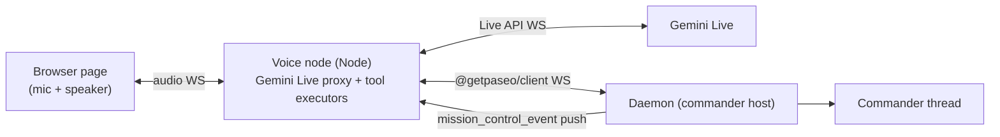

# Commander Voice

A voice front-end for the Commander: you talk, it dispatches, the fleet works. Built on the Gemini Live API (bidirectional audio streaming with server-side tool calling), starting from the `gemini-live-speech` prototype on iammvaibhav (`~/experiments/gemini-live-speech`: a Node WS proxy bridging browser audio to Gemini Live, with server-side tool executors). [docs/commander.md](commander.md) owns what the Commander is; this doc owns the voice layer in front of it.

## Design position

The voice agent is a **thin relay, not a second brain**. It never places work, never picks hosts, never holds fleet tools. All intelligence stays in the Commander; the voice layer converts speech to dispatches and events to speech. This keeps one placement doctrine, one approval gate, one context architecture — voice is another client, like the app.

Non-blocking by construction: a dispatch returns immediately and the voice agent acks ("on it"); results arrive later as daemon pushes. You can stack up as many tasks as you want; nothing in the voice session ever awaits a Commander turn.

## Architecture

The voice node runs on the commander host next to the daemon. It holds the Gemini API key and the daemon password; the browser page holds nothing.

## The tool surface (four tools, no more)

| Tool                                                   | Behavior                                                                                                                                          | Latency class             |
| ------------------------------------------------------ | ------------------------------------------------------------------------------------------------------------------------------------------------- | ------------------------- |
| `fleet_status()`                                       | Deterministic board summary from the daemon (buckets, counts, needs-you items). No Commander involved.                                            | Instant                   |
| `commander_dispatch(message)`                          | Sends your intent to the Commander thread and returns `{ok}` immediately. The Commander does its normal thing — triage, doctrine, proposal cards. | Instant ack, async result |
| `proposal_respond(proposalId, action, editedMessage?)` | Approve / deny / edit a pending proposal — the same RPC the app's cards use.                                                                      | Instant                   |
| `pending_updates()`                                    | Drains the update buffer: completions, verdicts, blocked items, Commander answers that arrived while you weren't asking.                          | Instant                   |

Voice never gets `fleet_create_agent` or any mutating fleet tool. If the Commander can't do it, voice can't either — the ask is roadmap signal, same rule as always.

## Announce policy (the chattiness contract)

The voice agent speaks only when:

1. **You asked something** — it answers.
2. **A proposal needs you** — it reads a one-line summary ("Commander wants to spawn a worker on your personal server for the speech app — approve?") and waits for your verbal approve/deny/edit.
3. **A needs-you blocker landed** — one sentence, then silence.

Everything else — started, finished, milestones, verdicts — queues silently into the update buffer. "Any updates?" drains it as a spoken digest. The policy lives in the voice system prompt and in the proxy's event filter: the proxy only _injects_ proposal and needs-you events into the live session; routine events go straight to the buffer without touching the model.

Voice approvals of `destructive`-classified proposals repeat the classification aloud and require an explicit "yes, approve" — a bare "ok" is not consent for those.

## Event flow

Daemon pushes (`mission_control_event`) arrive at the proxy over the client WS:

- `proposal` events → injected into the Gemini session as a system text turn → spoken, approval captured, `proposal_respond` fired.
- Needs-you lifecycle events → injected, one-sentence announcement.
- Everything else → update buffer (ring, capped, newest-first), never injected.

Commander answers to a dispatched question come back as thread events; the proxy routes them like proposals (spoken) when the session is waiting on that dispatch, else buffers them.

## Testing

No microphone needed. Two harness layers:

1. **Logic tests (text mode)**: the Live API accepts text turns in the same session protocol. A headless WS client drives the proxy with text intents and asserts tool-call sequences and daemon effects (proposal created on the dev daemon, `proposal_respond` fired, worker record appears). Deterministic, runs against `.dev/paseo-home`.
2. **E2E audio proof**: synthesize spoken commands with fish.audio TTS (`FISH_AUDIO_API_KEY` in `~/.zshrc` on iammvaibhav), stream the PCM into the Live session as mic audio, capture the audio replies, and assert the daemon effects. This proves the actual modality once per milestone; logic tests carry the regression load.

Both run against the dev daemon per [docs/agent-driven-development.md](agent-driven-development.md) — never against 6767.

## V1 scope and later

V1 is a standalone web app in the `experiments` project (promotion candidate, per the doctrine): the existing proxy + page, rewired from `search_internet` demo tools to the four-tool surface, with the announce policy and the daemon client. Later, the same proxy backs a mic button in the Mission Control screen; the app already speaks the daemon protocol, so integration is UI work, not architecture work.
