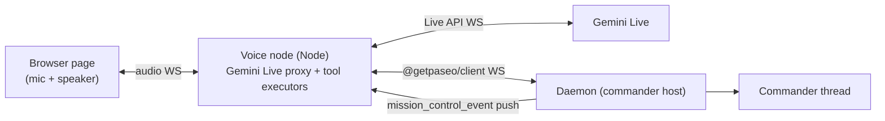
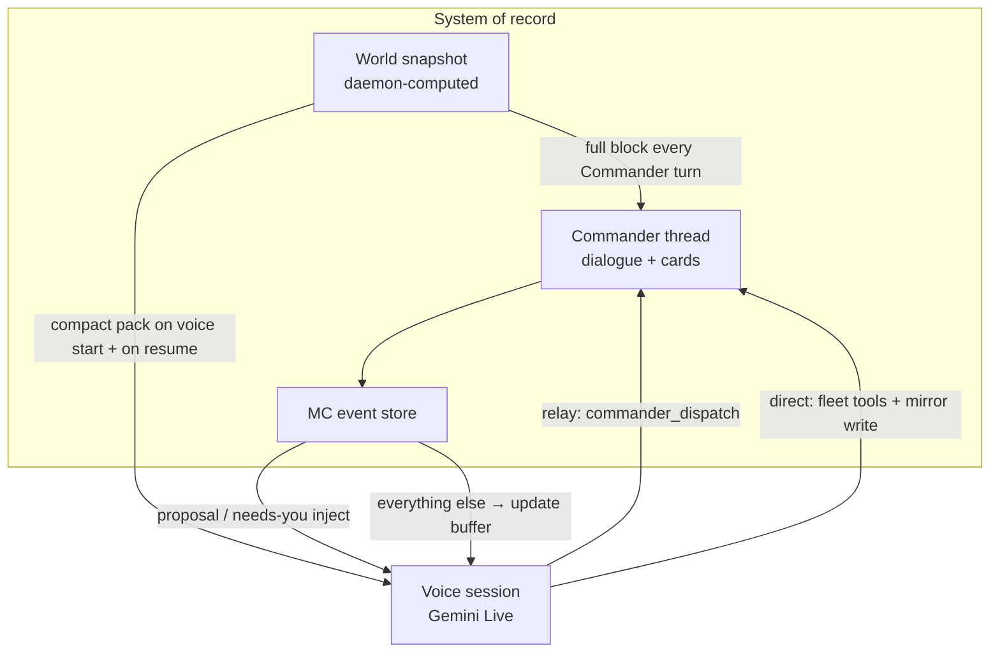

# Commander Voice

A voice front-end for the Commander: you talk, it dispatches, the fleet works. Built on the Gemini Live API (bidirectional audio streaming with server-side tool calling), starting from the `gemini-live-speech` prototype on iammvaibhav (`~/experiments/gemini-live-speech`: a Node WS proxy bridging browser audio to Gemini Live, with server-side tool executors). [docs/commander.md](commander.md) owns what the Commander is; this doc owns the voice layer in front of it.

## Design position

The voice agent is a **thin relay, not a second brain**. It never places work, never picks hosts, never holds fleet tools. All intelligence stays in the Commander; the voice layer converts speech to dispatches and events to speech. This keeps one placement doctrine, one approval gate, one context architecture — voice is another client, like the app.

Non-blocking by construction: a dispatch returns immediately and the voice agent acks ("on it"); results arrive later as daemon pushes. You can stack up as many tasks as you want; nothing in the voice session ever awaits a Commander turn.

## Architecture

The voice node runs on the commander host next to the daemon. It holds the Gemini API key and the daemon password; the browser page holds nothing.

## The tool surface (four tools, no more)

| Tool                                                   | Behavior                                                                                                                                                                        | Latency class             |
| ------------------------------------------------------ | ------------------------------------------------------------------------------------------------------------------------------------------------------------------------------- | ------------------------- |
| `fleet_status()`                                       | Deterministic board summary from the daemon (buckets, counts, needs-you items). Counts cover agents on the connected host only; the spoken line says so. No Commander involved. | Instant                   |
| `commander_dispatch(message)`                          | Sends your intent to the Commander thread and returns `{ok}` immediately. The Commander does its normal thing — triage, doctrine, proposal cards.                               | Instant ack, async result |
| `proposal_respond(proposalId, action, editedMessage?)` | Approve / deny / edit a pending proposal — the same RPC the app's cards use.                                                                                                    | Instant                   |
| `pending_updates()`                                    | Drains the update buffer: completions, verdicts, blocked items, Commander answers that arrived while you weren't asking.                                                        | Instant                   |

Voice never gets `fleet_create_agent` or any mutating fleet tool. If the Commander can't do it, voice can't either — the ask is roadmap signal, same rule as always.

## Announce policy (the chattiness contract)

The voice agent speaks only when:

1. **You asked something** — it answers.
2. **A proposal needs you** — it reads a one-line summary ("Commander wants to spawn a worker on your personal server for the speech app — approve?") and waits for your verbal approve/deny/edit.
3. **A needs-you blocker landed** — one sentence, then silence.

Everything else — started, finished, milestones, verdicts — queues silently into the update buffer. "Any updates?" drains it as a spoken digest. The policy lives in the voice system prompt and in the proxy's event filter: the proxy only _injects_ proposal and needs-you events into the live session; routine events go straight to the buffer without touching the model.

Voice approvals of `destructive`-classified proposals repeat the classification aloud and require an explicit "yes, approve" — a bare "ok" is not consent for those.

## Event flow

Daemon pushes (`mission_control_event`) arrive at the proxy over the client WS:

- `proposal` events → injected into the Gemini session as a system text turn → spoken, approval captured, `proposal_respond` fired.
- Needs-you lifecycle events → injected, one-sentence announcement.
- Everything else → update buffer (ring, capped, newest-first), never injected.

Commander answers to a dispatched question come back as thread events; the proxy routes them like proposals (spoken) when the session is waiting on that dispatch, else buffers them.

## Testing

No microphone needed. Two harness layers:

1. **Logic tests (text mode)**: the Live API accepts text turns in the same session protocol. A headless WS client drives the proxy with text intents and asserts tool-call sequences and daemon effects (proposal created on the dev daemon, `proposal_respond` fired, worker record appears). Deterministic, runs against `.dev/paseo-home`.
2. **E2E audio proof**: synthesize spoken commands with fish.audio TTS (`FISH_AUDIO_API_KEY` in `~/.zshrc` on iammvaibhav), stream the PCM into the Live session as mic audio, capture the audio replies, and assert the daemon effects. This proves the actual modality once per milestone; logic tests carry the regression load.

Both run against the dev daemon per [docs/agent-driven-development.md](agent-driven-development.md) — never against 6767.

## Modes: relay vs direct (proposal)

Default today is **relay**. **Direct** is an experimental second mode so we can try “voice holds the brain” without forking product logic.

### Does Commander use `fleet_status`?

No. `fleet_status` is voice-only, host-local, and deterministic. Commander never calls it. Commander uses fleet tools (`fleet_list_agents`, `fleet_get_agent_activity`, `fleet_search`, …) plus the world snapshot. That split is why voice can say “0 running” while the board shows remote workers: voice counted one host; Commander sees the fleet.

### Two modes

| Mode                    | Voice model tools                                                                                                                                      | Who decides placement / answers fleet questions | What the Commander thread shows                                                                                                                |
| ----------------------- | ------------------------------------------------------------------------------------------------------------------------------------------------------ | ----------------------------------------------- | ---------------------------------------------------------------------------------------------------------------------------------------------- |
| **relay** (default)     | 4 tools: `fleet_status`, `commander_dispatch`, `proposal_respond`, `pending_updates`                                                                   | Commander                                       | Every voice ask that needed intelligence lands as a user/voice message + cards                                                                 |
| **direct** (experiment) | Same _semantic_ fleet tool surface as Commander (create/send/list/activity/search/meta/answer/clarify…), executed by the voice node against the daemon | Voice Gemini Live                               | Mirrored: every tool call and spoken answer is also written into the Commander thread as source=`voice` so the chat stays the system of record |

Direct does **not** mean a second silent brain. It means the Live model may call fleet tools itself. The Commander agent record remains the durable transcript and approval surface.

### Shared contract (both modes stay in sync)

One contract package both surfaces import. Do not copy tool lists into the voice node by hand.

| Shared piece                              | Owner                                                    | Used by                                                                 |
| ----------------------------------------- | -------------------------------------------------------- | ----------------------------------------------------------------------- |
| Tool names + schemas + allowlist hash     | Commander contract (`commander-contract` / tool catalog) | Commander launch; voice **direct** mode declarations                    |
| Placement doctrine + system rules         | `commander-prompt.md` (static)                           | Commander always; voice direct gets a _spoken_ subset of the same rules |
| World snapshot (hosts, inventory, roster) | Daemon `buildWorldSnapshot` / context pack               | Commander every turn; voice gets a **compact pack** only (see below)    |
| Approval gate                             | Daemon proposal RPCs                                     | Both modes for every mutating action                                    |
| Event store + feed cards                  | Mission Control events                                   | Both; voice still speaks only per announce policy                       |

When the allowlist or doctrine changes, both modes change together because they import the same package. Untagged divergence is a bug.

### Source of truth and context flow

Rules:

1. **Commander is source of truth.** Cards, proposals, ledger rows, and history live on the Commander thread. Voice never owns a parallel durable dialogue.
2. **Voice must not be flooded.** Live audio context is short and expensive. Do not inject the full world snapshot on every turn. Voice gets a compact pack at session start and after reconnect only.
3. **Relay mode:** intelligence stays in Commander; voice only dispatches and speaks results.
4. **Direct mode:** voice may call fleet tools; each call is logged and **mirrored** into the Commander thread (tool summary + result headline) so the UI chat matches what voice did. Mutating tools still go through the approval gate — same as Commander.
5. **Announce policy is mode-invariant.** Only answers to the user, proposals, and needs-you blockers are spoken unprompted.

### Compact pack for voice (start + resume)

Feed the Live session once when it opens (and again after a hard reconnect that could not resume the Gemini handle):

| Include                                                  | Why                                                  |
| -------------------------------------------------------- | ---------------------------------------------------- |
| Host map (name + alias + online/unreachable)             | Placement without a tool round-trip                  |
| Running / needs-you counts per host (not full roster)    | Honest fleet status without host-local lies          |
| Open instruction ledger ids (if any)                     | Continuity with Commander mailbox                    |
| Last 3–5 voice turns (heard + spoken) on resume fallback | Local dialogue continuity when Gemini handle is dead |
| Pending proposal one-liners                              | So “approve” still has targets                       |

Do **not** include: full project/workspace inventory, model catalogs, long agent descriptions, full event history, raw tool dumps.

If the user asks something the compact pack cannot answer, **relay** dispatches to Commander; **direct** calls `fleet_list_agents` / `fleet_search` / etc.

### Recommendation for the experiment

1. Ship backend observability + session resume first (forensics before dual brain).
2. Add `VOICE_MODE=relay|direct` on the voice node (default `relay`).
3. Implement direct mode as: import Commander tool declarations → execute via daemon peer RPCs the Commander already uses → mirror each call into the Commander thread with `source: "voice"`.
4. Keep one approval gate. Direct mode must not bypass Ask/Auto.
5. Evaluate on real sessions: latency of direct tool loops vs relay “on it” + async card; quality of placement; whether mirroring keeps the chat usable.

If direct works, product choice is still open: keep both modes, or promote direct and leave Commander as the durable log + text client. Do not delete relay until direct has proven mirror fidelity and approval safety.

## Observability (Session JSONL Logs)

Forensic session logs live at `$PASEO_HOME/commander-voice/sessions/<sessionId>.jsonl` (default `~/.paseo/commander-voice/sessions/`). A `latest.jsonl` symlink points to the most recent session file. Override the log directory using the `VOICE_SESSION_LOG_DIR` environment variable.

### Event types

Each JSON line contains `ts`, `sessionId`, and `event`:

| Event                  | Fields                                    | Meaning                                                   |
| ---------------------- | ----------------------------------------- | --------------------------------------------------------- |
| `session.start`        | `model`, `voiceName`                      | Voice session initialized                                 |
| `session.end`          | `reason`                                  | Session closed (`client_disconnected`, etc.)              |
| `client.connect`       | —                                         | Browser WebSocket connected                               |
| `client.close`         | —                                         | Browser WebSocket closed                                  |
| `gemini.setup`         | `model`, `voiceName`                      | Sent setup message to Gemini WSS                          |
| `gemini.setupComplete` | —                                         | Gemini confirmed setup ready                              |
| `gemini.goAway`        | `code`, `reason`, `timeLeft`              | Gemini sent disconnect notice                             |
| `gemini.close`         | `code`, `reason`                          | Gemini WebSocket closed                                   |
| `gemini.error`         | `error`                                   | Gemini WebSocket error                                    |
| `tool.call`            | `name`, `args`, `callId`                  | Model requested tool execution                            |
| `tool.result`          | `name`, `callId`, `ok`, `summary`/`error` | Tool execution completed (summary truncated at 500 chars) |
| `resume.attempt`       | `attempt`, `handle`                       | Reconnect attempt using resumption handle                 |
| `resume.success`       | `handle`                                  | Reconnect succeeded                                       |
| `resume.fail`          | `reason`                                  | Reconnect failed, falling back to fresh session           |

### How to debug a bad status answer or tool failure

1. Open the latest log file: `tail -f ~/.paseo/commander-voice/sessions/latest.jsonl`.
2. Find the `tool.call` event by name (for example, `fleet_status` or `commander_dispatch`). Note the `callId`.
3. Locate the corresponding `tool.result` event matching that `callId`.
4. Inspect `ok` and `summary` (or `error`). If `ok` is false, check `error`.
5. For disconnection issues, locate `gemini.goAway`, `gemini.close`, or `gemini.error` events to determine disconnect code and reason.

## Session Resume (Gemini Live Auto-Reconnect)

Gemini Live sessions auto-reconnect when disconnected while the browser client remains open.

- **Resumption handle:** `setup` includes `sessionResumption`. Gemini updates the handle via `sessionResumptionUpdate.newHandle`.
- **Sliding window compression:** `contextWindowCompression` prevents session expiration during long turns (>15 minutes).
- **GoAway handling:** When Gemini sends `goAway`, the proxy logs disconnect details and prepares reconnect state before socket drop.
- **Reconnect flow:** If disconnected, the proxy attempts reconnect with backoff using the last handle (up to 5 attempts). If resumption fails, it starts a fresh session and re-injects compact voice context (recent turns + pending dispatches).

## V1 scope and later

V1 is a standalone web app in the `experiments` project (promotion candidate, per the doctrine): the existing proxy + page, rewired from `search_internet` demo tools to the four-tool surface, with the announce policy and the daemon client. Later, the same proxy backs a mic button in the Mission Control screen; the app already speaks the daemon protocol, so integration is UI work, not architecture work. The dual-mode experiment above is the next architecture step after observability and Live session resume.
